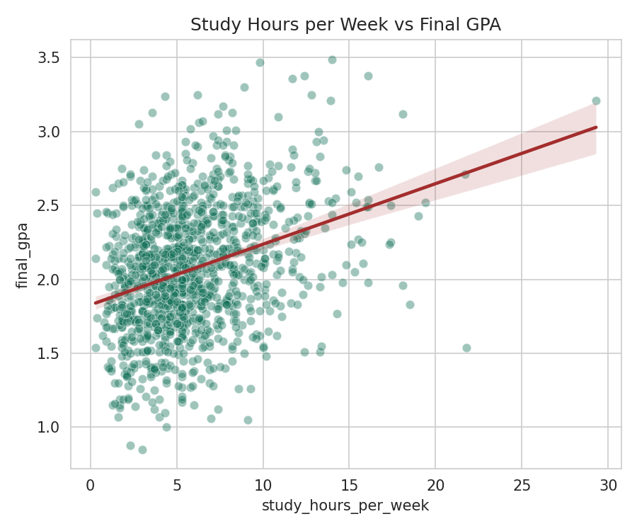
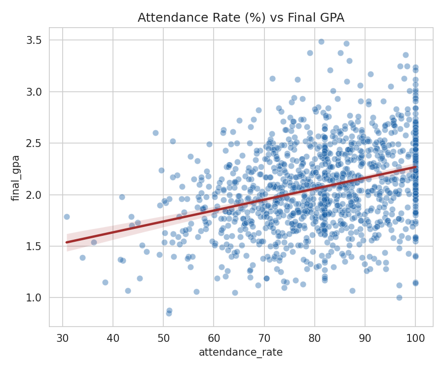
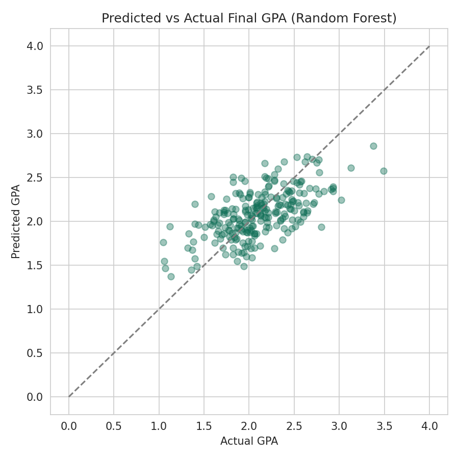

# Academic Performance Analysis & Prediction

> End-to-end data pipeline: cleaning a messy real-world-style dataset, exploratory analysis, and a predictive model for student final GPA — with a Power BI-ready export.

## Overview

This project simulates a common real-world data analytics scenario: a raw dataset export that is **messy by default** — missing values, duplicate records, and inconsistent text formatting — and needs to be cleaned before it can be trusted for analysis or prediction.

The dataset is **synthetically generated** with realistic relationships between study habits (study hours, attendance) and academic outcomes (final GPA), and deliberately includes data-quality issues to practice genuine data cleaning rather than working with an already-clean dataset.

## Key results

- **Data cleaning**: removed 24 duplicate records, imputed 147 missing values across 3 columns using median imputation, and standardised inconsistent text formatting (casing, whitespace)
- **Predictive model**: Random Forest Regressor achieving **R² = 0.375**, **MAE = 0.26** GPA points on held-out test data
- Model comparison between Linear Regression and Random Forest to check whether the relationship is meaningfully non-linear (it is not, strongly — the two models perform similarly, which is itself a useful finding)

## Why the R² isn't higher — and why that's the honest result

A student's final GPA depends on far more than study hours, attendance, and prior GPA — motivation, course difficulty, personal circumstances, and pure chance all play a role that isn't captured in this dataset. An R² of ~0.38 means the model explains about 38% of the variation in final GPA from these features alone, which is a realistic and defensible result for this kind of behavioural prediction problem — a suspiciously perfect score would be a red flag rather than a strength.

## Tech stack

`Python` `pandas` `scikit-learn` `Matplotlib` `Seaborn` `Power BI`

## Methods used

- Data cleaning: deduplication, median imputation for missing values, text standardisation (casing, whitespace)
- Exploratory data analysis: relationship between study hours, attendance, and final GPA
- Predictive modelling: Linear Regression (baseline) vs Random Forest Regressor
- Model evaluation: MAE and R² on a held-out test set
- Export of cleaned dataset for Power BI dashboard integration

## Project structure

```
academic-performance-analysis/
├── data/
│   ├── generate_data.py       # generates the synthetic, intentionally messy dataset
│   └── students_raw.csv       # raw dataset (1,224 records, with data-quality issues)
├── src/
│   └── analysis.py            # cleaning, EDA, model training and evaluation
├── outputs/
│   ├── study_hours_vs_gpa.png
│   ├── attendance_vs_gpa.png
│   ├── gpa_by_major.png
│   ├── predicted_vs_actual.png
│   └── students_clean.csv     # cleaned dataset, ready for Power BI import
├── requirements.txt
└── README.md
```

## How to run

```bash
# 1. Clone the repository
git clone https://github.com/YOUR_USERNAME/academic-performance-analysis
cd academic-performance-analysis

# 2. Install dependencies
pip install -r requirements.txt

# 3. Generate the raw (messy) dataset
python data/generate_data.py

# 4. Run the full pipeline (cleaning, analysis, model training)
python src/analysis.py
```

All outputs (charts + the cleaned CSV) are saved to the `outputs/` folder.

## Results

**Study hours vs Final GPA:**



**Attendance rate vs Final GPA:**



**Predicted vs Actual GPA (model performance):**



## Notes & limitations

- This project uses **synthetic data**; it is not based on real student records.
- The moderate R² is an honest reflection of how much of academic performance is explainable from behavioural features alone — not a modelling shortcoming.
- In a real institutional setting, additional features (course difficulty, socioeconomic factors, prior coursework) would likely improve predictive power, alongside careful attention to fairness and privacy when using student data.

---

*Built by [Yacouba Konaté](https://github.com/YOUR_USERNAME) — Computer Engineer, MSc AI Engineering candidate.*
