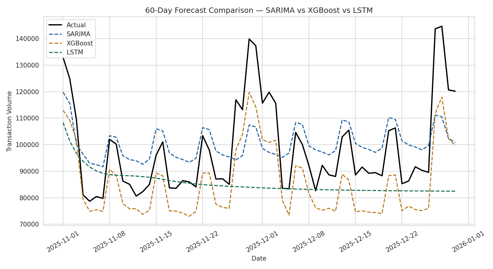
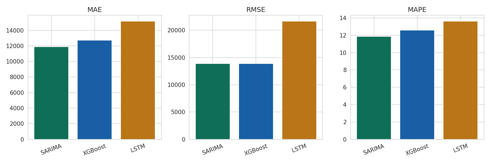

# Mobile Money Transaction Volume Forecasting

> Comparative time series forecasting: Statistical (SARIMA) vs Machine Learning (XGBoost) vs Deep Learning (LSTM) — applied to daily mobile money transaction volume.

## Overview

This project forecasts daily mobile money transaction volume 60 days into the future, comparing three families of forecasting methods side by side — the same comparative methodology used in academic time series research (e.g. macroeconomic forecasting, demand forecasting):

- **SARIMA** — a classical statistical model that explicitly models trend and seasonality
- **XGBoost** — a gradient-boosted tree model using lag and calendar features
- **LSTM** — a recurrent neural network learning temporal patterns directly from the raw sequence

The dataset is **synthetically generated** with realistic structure: a long-term adoption trend, weekly seasonality (weekend spikes), monthly seasonality (salary-day spikes around the 1st and 27th–28th), a smooth yearly cycle, and random noise — mirroring the structure of real telecom and banking transaction data.

## Key results (60-day held-out forecast)

| Model | MAE | RMSE | MAPE |
|---|---|---|---|
| **SARIMA** | 11,896 | 13,912 | **11.86%** |
| XGBoost | 12,721 | 13,887 | 12.58% |
| LSTM | 15,178 | 21,681 | 13.63% |

**SARIMA performs best** on this dataset. This is a realistic and academically well-documented finding, not a limitation of the implementation: statistical models with an explicit seasonal structure often outperform ML/DL approaches on datasets of this size (~2 years of daily data) and with strong, regular seasonality — deep learning models typically need substantially more data to reliably outperform well-specified statistical baselines.

## An honest limitation, and what it teaches

Looking at the forecast comparison chart, the LSTM's forecast visibly flattens toward the mean over the 60-day horizon. This is a well-known behaviour of **iterative multi-step forecasting** with recurrent networks: each prediction is fed back in as input for the next step, so small errors compound and the model gradually "forgets" the seasonal pattern and reverts toward the average. This is exactly why production forecasting systems either retrain on a rolling window, use direct multi-step forecasting (training a separate model per horizon), or use architectures specifically designed for long-horizon forecasting (e.g. N-BEATS, Temporal Fusion Transformer) — an intentional design trade-off this project surfaces rather than hides.

## Tech stack

`Python` `statsmodels (SARIMA)` `XGBoost` `TensorFlow / Keras (LSTM)` `pandas` `scikit-learn` `Matplotlib` `Power BI`

## Methods used

- **Time-aware train/test split**: the last 60 days are held out as the test set — time series data must never be shuffled randomly before splitting, as this leaks future information into training
- **SARIMA**: order (2,1,2), seasonal order (1,1,1,7) to capture weekly seasonality
- **XGBoost**: lag features (1, 2, 3, 7, 14 days), 7-day rolling mean, and calendar features (day of week, day of month, month), with iterative forecasting
- **LSTM**: 14-day sliding window input, single LSTM layer (32 units) + dense layers, trained on Min-Max scaled data
- **Evaluation**: MAE, RMSE, and MAPE — MAPE in particular is reported because it is scale-independent and directly interpretable ("the forecast is off by X% on average")

## Project structure

```
mobile-money-transaction-forecasting/
├── data/
│   ├── generate_data.py           # generates the synthetic transaction volume series
│   └── transaction_volume.csv     # generated dataset (730 days)
├── src/
│   └── forecasting.py             # SARIMA + XGBoost + LSTM pipeline, evaluation, charts
├── outputs/
│   ├── forecast_comparison.png
│   ├── metrics_comparison.png
│   ├── forecast_results.csv       # ready for Power BI import
│   └── model_comparison_metrics.csv
├── requirements.txt
└── README.md
```

## How to run

```bash
# 1. Clone the repository
git clone https://github.com/YACOUBA-KONATE/mobile-money-transaction-forecasting
cd mobile-money-transaction-forecasting

# 2. Install dependencies
pip install -r requirements.txt

# 3. Generate the synthetic dataset
python data/generate_data.py

# 4. Run the full comparison pipeline
python src/forecasting.py
```

Note: training the LSTM can take a few minutes on CPU. All outputs (charts + CSVs) are saved to the `outputs/` folder.

## Results

**60-day forecast comparison:**



**Error metrics by model:**



## Relevance

This project applies the same three-family forecasting comparison (statistical / ML / deep learning) used in my MSc thesis on consumer price inflation forecasting in Mali, adapted here to a banking/telecom transaction volume context — directly relevant to demand forecasting, liquidity planning, and capacity management in mobile money and digital banking operations.

## Notes & limitations

- This project uses **synthetic data**; it is not based on real transaction records.
- SARIMA parameters were chosen based on the known synthetic seasonal structure; in a real deployment, parameters would be selected via a systematic search (e.g. `pmdarima.auto_arima`) and validated against domain knowledge.
- The LSTM uses a relatively simple architecture and a basic iterative forecasting strategy; production systems would typically use a larger training set, a validation-based early stopping strategy, and potentially a direct multi-step or attention-based architecture (e.g. N-BEATS, TFT) for longer horizons.

---

*Built by [Yacouba Konaté](https://github.com/YACOUBA-KONATE) — Computer Engineer, MSc AI Engineering candidate. Companion project to my thesis work on time series forecasting methods.*
